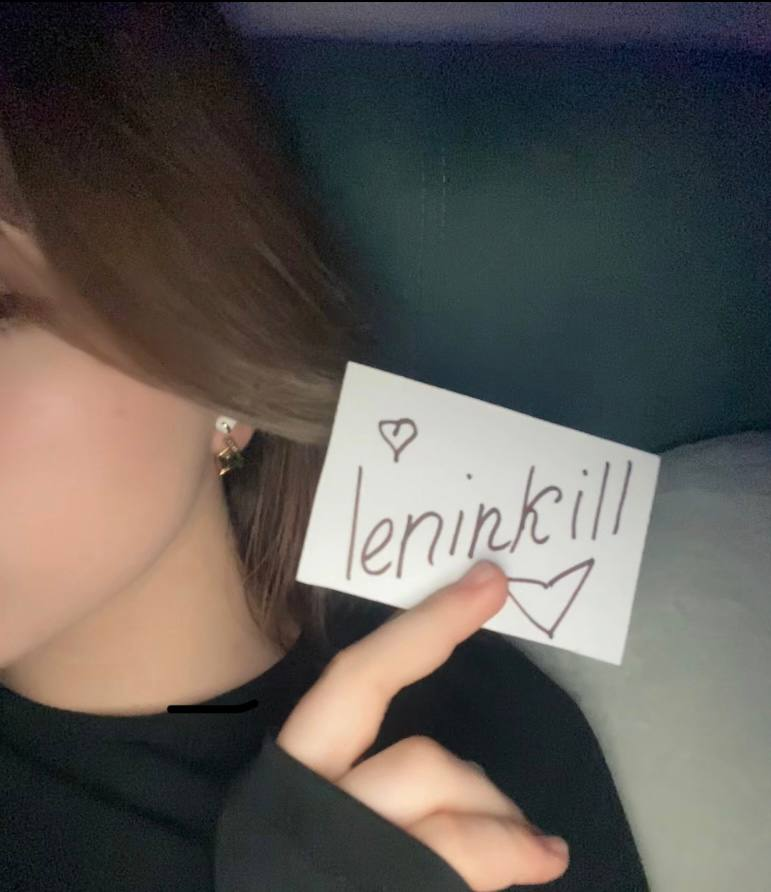

	
   <h3> Hi there 👋, I'm Sasha </h3>

  
   
  
   
   
   
	

### I'm an Junior Programmer
- 🖥️ I am programming on C#(Unity 3D), Frontend, Python, Figma
- 💪 I like to write code
- 👅 I like pussy licking
- 🥅 I am constantly learning new things
- 🎮 I love playing games

 

### 🧰 Languages and Tools:

 
 

### Connect with me:

[][tg]

 

### :zap: Statistics:

 

[vk]: https://vk.com/leninkill
[tg]: https://t.me/leninkill
